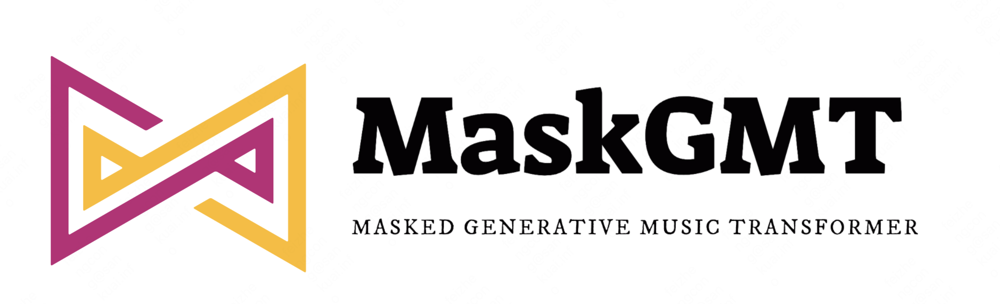

     
      

MaskGMT is a music generation paradigm using a hierarchy bidirectional transformer and tokenize-detokenize encodec. 
During training, MaskGMT learns to predict randomly masked tokens by attending to tokens in all directions. 
At inference time, the model begins with generating all main tokens of a music sequence simultaneously, and then refines the residual sequence iteratively conditioned on the previous generation. 

# Usage

1. parepare for music compression 

2. generate music token sequence 

# Acknowledge 

Our code is based on [MaskGiT](https://github.com/lucidrains/muse-maskgit-pytorch) and [Huggingface](https://github.com/huggingface/transformers). Thanks for their clear code. 
